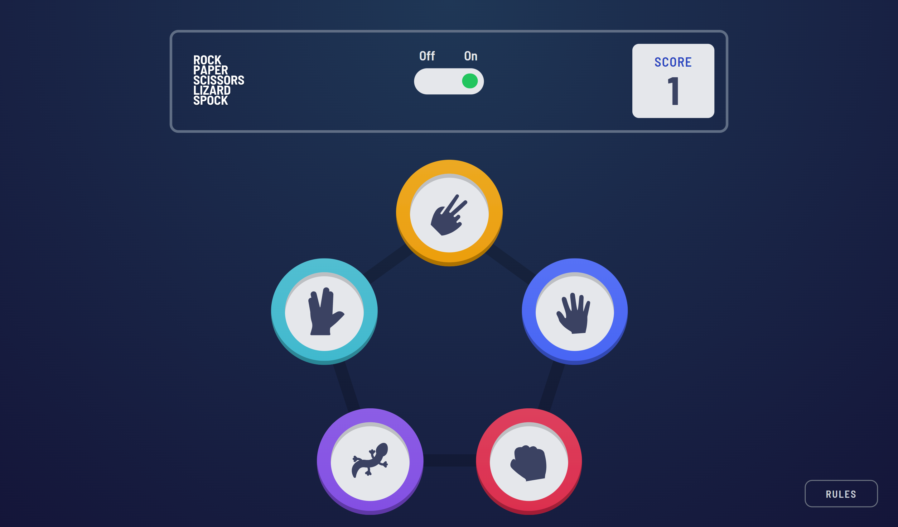
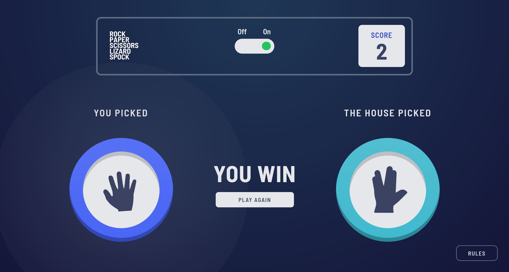
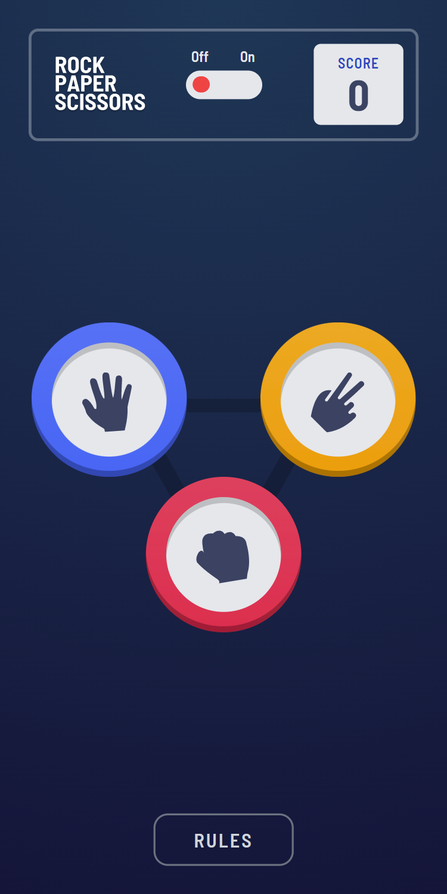
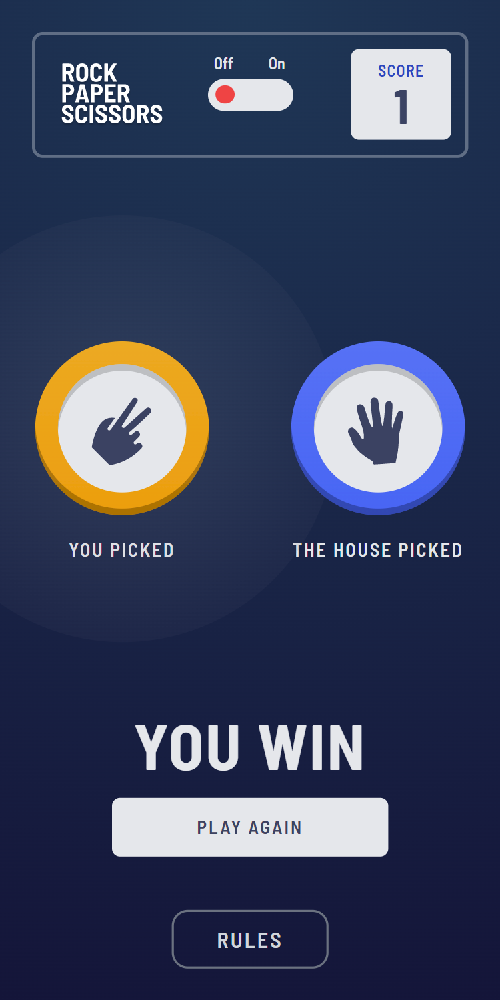

# Frontend Mentor - Rock, Paper, Scissors solution

This is a solution to the [Rock, Paper, Scissors challenge on Frontend Mentor](https://www.frontendmentor.io/challenges/rock-paper-scissors-game-pTgwgvgH). Frontend Mentor challenges help you improve your coding skills by building realistic projects. 

## Table of contents

- [Overview](#overview)
  - [The challenge](#the-challenge)
  - [Screenshot](#screenshot)
- [My process](#my-process)
  - [Built with](#built-with)
  - [What I learned](#what-i-learned)
  - [Useful resources](#useful-resources)
- [Author](#author)
- [Acknowledgments](#acknowledgments)

## Overview

### The challenge

Users should be able to:

- View the optimal layout for the game depending on their device's screen size
- Play Rock, Paper, Scissors against the computer
- Maintain the state of the score after refreshing the browser _(optional)_
- **Bonus**: Play Rock, Paper, Scissors, Lizard, Spock against the computer _(optional)_

### Screenshot

## My process

### Built with

- [React](https://reactjs.org/) - JS library
- [TypeScript](https://www.typescriptlang.org/) - JS Superset
- [Tailwind CSS](https://tailwindcss.com/) - Styles

### What I learned

I learned a ton about working with gradients, extending Tailwind CSS gradients, and usings gradients and filters with SVGs. I also learned about making modals from scratch. This project relied heavily on dynamic styles and ternary operators for the bonus mode.

### Useful resources

- [Radial-Gradient Support](https://github.com/tailwindlabs/tailwindcss/discussions/2599) - Code to extend Tailwind CSS with radial gradients
- [Gradients in SVG](https://developer.mozilla.org/en-US/docs/Web/SVG/Tutorial/Gradients) - This helped to learn the basics of SVG gradients, before extending to React SVG components

## Author

- Website - [Justin Fowler Art](https://www.justinfowlerart.com)